# TempoOS

<p align="center">
  <picture>
    <source media="(prefers-reduced-motion: reduce)" srcset="assets/hero/hero-reduced.svg">
    <source media="(prefers-color-scheme: light)" srcset="assets/hero/hero-light.svg">
    
  </picture>
</p>

<p align="center">
  <picture>
    <source media="(prefers-reduced-motion: reduce)" srcset="assets/hero/computational-dark.svg">
    <source media="(prefers-color-scheme: light)" srcset="assets/hero/computational-light.svg">
    
  </picture>
</p>

The AI operating system for time allocation, focus protection, and adaptive weekly planning.

## Setup

1. Clone the repository
2. Install dependencies:
   ```bash
   npm install
   ```
3. Copy `.env.example` to `.env.local` and fill in the values
4. Run the development server:
   ```bash
   npm run dev
   ```

## Deployment

TempoOS is optimized for Vercel deployment:

1. Push your changes to GitHub
2. Create a new Vercel project
3. Connect your GitHub repository
4. Add environment variables in Vercel dashboard
5. Deploy!

## Environment Variables

- `NEXT_PUBLIC_SUPABASE_URL`: Your Supabase project URL
- `NEXT_PUBLIC_SUPABASE_ANON_KEY`: Your Supabase anon key
- `NEXT_PUBLIC_PLAUSIBLE_DOMAIN`: (Optional) For analytics

## Tech Stack

- Next.js 14
- Tailwind CSS
- Supabase (coming soon)
- TypeScript

<!-- TRILLIONX:presentation:begin -->

### Animated surfaces

Generated from this repository's own source tree: every count, route and module below was measured, not written by hand.

#### Identity

<picture>
  <source media="(prefers-reduced-motion: reduce)" srcset="https://raw.githubusercontent.com/M4G3LL4N0/tempoos/main/.github-art/surfaces/hero-reduced.svg">
  <source media="(prefers-color-scheme: light)" srcset="https://raw.githubusercontent.com/M4G3LL4N0/tempoos/main/.github-art/surfaces/hero-light.svg">
  
</picture>

#### Entry points

<picture>
  <source media="(prefers-reduced-motion: reduce)" srcset="https://raw.githubusercontent.com/M4G3LL4N0/tempoos/main/.github-art/surfaces/terminal-reduced.svg">
  <source media="(prefers-color-scheme: light)" srcset="https://raw.githubusercontent.com/M4G3LL4N0/tempoos/main/.github-art/surfaces/terminal-light.svg">
  
</picture>

#### Modules

<picture>
  <source media="(prefers-reduced-motion: reduce)" srcset="https://raw.githubusercontent.com/M4G3LL4N0/tempoos/main/.github-art/surfaces/architecture-reduced.svg">
  <source media="(prefers-color-scheme: light)" srcset="https://raw.githubusercontent.com/M4G3LL4N0/tempoos/main/.github-art/surfaces/architecture-light.svg">
  
</picture>

#### Routes

<picture>
  <source media="(prefers-reduced-motion: reduce)" srcset="https://raw.githubusercontent.com/M4G3LL4N0/tempoos/main/.github-art/surfaces/data_flow-reduced.svg">
  <source media="(prefers-color-scheme: light)" srcset="https://raw.githubusercontent.com/M4G3LL4N0/tempoos/main/.github-art/surfaces/data_flow-light.svg">
  
</picture>

#### Composition

<picture>
  <source media="(prefers-reduced-motion: reduce)" srcset="https://raw.githubusercontent.com/M4G3LL4N0/tempoos/main/.github-art/surfaces/component_map-reduced.svg">
  <source media="(prefers-color-scheme: light)" srcset="https://raw.githubusercontent.com/M4G3LL4N0/tempoos/main/.github-art/surfaces/component_map-light.svg">
  
</picture>

#### Build and tests

<picture>
  <source media="(prefers-reduced-motion: reduce)" srcset="https://raw.githubusercontent.com/M4G3LL4N0/tempoos/main/.github-art/surfaces/build-reduced.svg">
  <source media="(prefers-color-scheme: light)" srcset="https://raw.githubusercontent.com/M4G3LL4N0/tempoos/main/.github-art/surfaces/build-light.svg">
  
</picture>

#### Identity object

<picture>
  <source media="(prefers-reduced-motion: reduce)" srcset="https://raw.githubusercontent.com/M4G3LL4N0/tempoos/main/.github-art/surfaces/footer-reduced.svg">
  <source media="(prefers-color-scheme: light)" srcset="https://raw.githubusercontent.com/M4G3LL4N0/tempoos/main/.github-art/surfaces/footer-light.svg">
  
</picture>

<!-- TRILLIONX:presentation:end -->

<!-- TRILLIONX:evidence:begin -->

## What is measurable here

Generated by `.github-art` from the source tree at publish time.

| Signal | Value |
| --- | --- |
| HTTP routes | 20 |
| Entry points | 3 |
| Module roots | 4 |
| Test files | 0 |
| CI workflows | 0 |
| Distinctive stack | Supabase, Zod |
| Status | PROTOTYPE |
| Evidence confidence | E3 |
| Animated surfaces | 7 |

<!-- TRILLIONX:evidence:end -->
